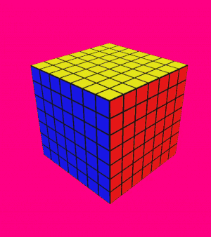

<br/>
<p align="center">
  <h3 align="center">rubik's cube</h3>
  <p align="center">
   An application that visualizes rubik's cubes of any size, using opengl and c++. The application allows you to move freely (free-cam), make cube moves from the visualization level, input sequences of moves in a normalized form, generate and execute random scrambles. All for any size of cube. In addition, it has built-in AI that solves the cube using the CFOP speedcubing method.
  </p>
</p>

## Demo
### visualization + scramble
_note:_ quality is lost by presentation in `.gif` format





### scramble + AI _CFOP_


- program prints out the scramble in (one of) the standardized forms, e.g.
```
UBDRffUrflfbRdLfDlrFRBFrfrFlUUffbUlRfuFdFRUDLuFdFDbrllbRBRBD
FBurlDlfUBBfLdFRLfDuuDlbddFUUrfDbUUbrlBBludULudbdlduuLbufuud
UdLUbrfbuulfDfuRDFRLFLBUDrdlfflDuFBuDrdUdufLflrlddbfLrFUlulb
FBrULULDULuuRRdrBrulFUDldLrbfLdddrULLLfDrFrddrfflldlBdudRfBf
```
- ai prints out movements required to solve puzzle, e.g. (solves corresponding scrambles above)
```
dRdfd^UFlfduRuruLulBubuFufu^buBUbuBulUfuFULulfuFULr^frurURFru^Ru^ru^
l^d^URfrlDr^d^u^BUb^uBurURu^LuluFu^fuFUfuBUbUBub^uLUBublBr^drDrf^Lulf^
Ldr^b^dURfrd^u^luLrURurURu^buBUbuBLUlULUBlURurLblbUBUbubdBUbDBu^Bu
Dr^DUBrbd^Ru^ruRu^rUlULU^LulUFufuFu^fU^lULuluLFl^blBlfLUluDl^uLulUlUl^du
```

